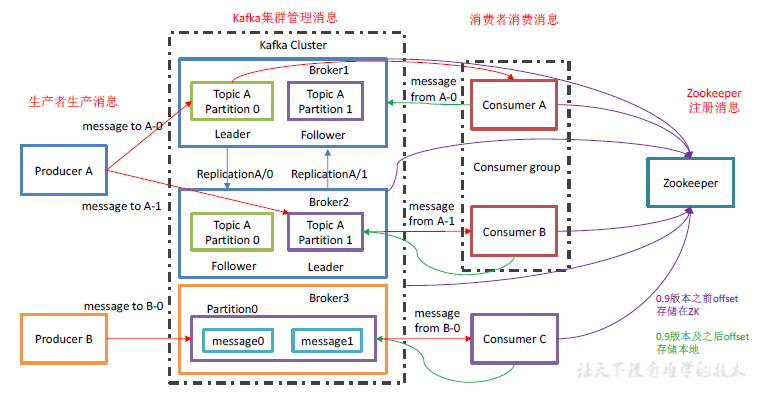

kafka的使用场景（今日头条测开二面，百度一面）

> [典型应用场景](https://support.huaweicloud.com/productdesc-kafka/kafka-scenarios.html)
>
> - 异步通信
> - 错峰流控与流量削峰
> - 日志同步

为什么使用RabbitMQ，而不是采用其它消息队列？（深信服二面）

> RabbitMQ和Kafka的区别：
>
> - 通常会使用Kafka作为消息传输的数据管道，RabbitMQ作为交易数据作为数据传输管道，主要的取舍因素则是存在丢数据的可能
> - RabbitMQ在金融场景下经常使用，具有较高的严谨性，数据丢失的可能性更小，同时具备更高的实时性
> - Kafka优势主要体现在吞吐量上，虽然可以通过策略实现数据不丢失，但从严谨性角度来讲，大不如RabbitMQ
> - 而且由于Kafka保证每条数据最少送达一次，有较小的概率会出现数据重复发送的情况

MQ发送消息的模式？（腾讯CDG一面）

> - 点对点模式。（一对一，消费者主动拉取数据，消息收到后消息清除）
> - 发布/订阅模式。（一对多，消费者消费数据之后不会清除消息）

MQ丢包怎么处理？（腾讯CDG一面，百度一面）

> | 场景         | 措施                                                         |
> | ------------ | ------------------------------------------------------------ |
> | 生产者       | 将发送消息的异步操作转换为同步操作，消息发送失败时检查原因，并重新发送 |
> | 消费者       | 把自动提交转换为手动提交                                     |
> | Kafka 服务端 | 1. 设置acks = all，即让消息被所有副本接受成功之后才算真正被发送成功 2. 增大副本的数量 |

Kafka如何搭建生产者和消费者（腾讯CDG事务开发一面）

Kafka的零拷贝（百度一面）

> [图解Kafka的零拷贝技术到底有多牛？](https://cloud.tencent.com/developer/article/1421266)
>
> - 传统的文件传输有多次用户态和内核态之间的切换，而且文件在多个buffer之间要复制多次最终才被发送到网卡。
> - DMA是一种硬件直接访问系统主内存的技术。
> - 多种硬件都已使用了DMA技术，其中就包括网卡（NIC）。
> - DMA技术让CPU得到解放，让CPU可以不用一直守着来完成文件传输。
> - 零拷贝技术减少了用户态与内核态之间的切换，让拷贝次数降到最低，从而实现高性能。
> - Kafka使用零拷贝技术来进行文件的传输。

Kafka的分布式（Lazada一面，百度一面，腾讯CDG事务开发一面）

> 
>
> - Producer：消费生产者，就是向kafka broker发消息的客户端；
>
> - Consumer：消息消费者，向kafka broker取消息的客户端；
>
> - Consumer Group（CG）：每个消费者属于一个特定的消费者组，一个消息可以被多个不同的消费者组消费。消费者组内每个消费者负责消费不同分区的数据，一个分区只能由一个组内消费者消费
> - Broker：一台kafka服务器就是一个broker。一个集群由多个broker组成。一个broker可以容纳多个topic。
>
> - Topic：可以理解为一个队列，生产者和消费者面向的都是一个topic；
>
> - Partition：为了实现可扩展性，一个非常大的topic可以分布到多个broker（即服务器）上，一个topic可以分为多个partition，每个partition是一个有序的队列；
>
> - Replica：副本，为保证集群中的某个节点发生故障时，该节点上的partition数据不会丢，且kafka仍然能够继续工作，kafka提供一个副本机制，一个topic的每个分区都有若干个副本，一个leader和若干个follower。
>
> - leader：每个分区多个副本的“主”，生产者发送数据的对象，以及消费者消费数据的对象都是leader。
>
> - follower：每个分区多个副本中的“从”，实时从leader中同步数据，保持和leader数据的同步。leader发生故障时，某个follower会成为新的leader。
>
> 
>
> **Kafka 的多分区（Partition）以及多副本（Replica）机制有什么好处呢？**
>
> 1. Kafka 通过给特定 Topic 指定多个 Partition, 而各个 Partition 可以分布在不同的 Broker 上, 这样便能提供比较好的并发能力（负载均衡）。
> 2. Partition 可以指定对应的 Replica 数, 这也极大地提高了消息存储的安全性, 提高了容灾能力，不过也相应的增加了所需要的存储空间。

